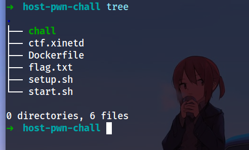
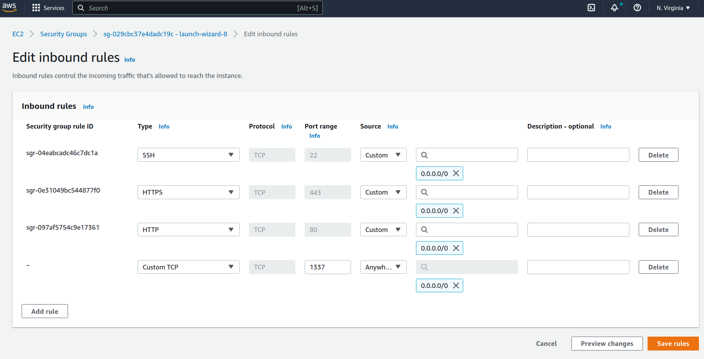

# Host-A-pwn-chall-in-Docker-via-EC2
### A small intro how to host pwn ctf challs in Docker via AWS EC2 Instance
#### File Structure

### AWS EC2 configure
### Step 1 

1. Create an Instance in aws , in security tab , click on inbound rules , there add custom TCP check box & add the custom port you want to host it on to

