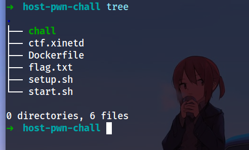
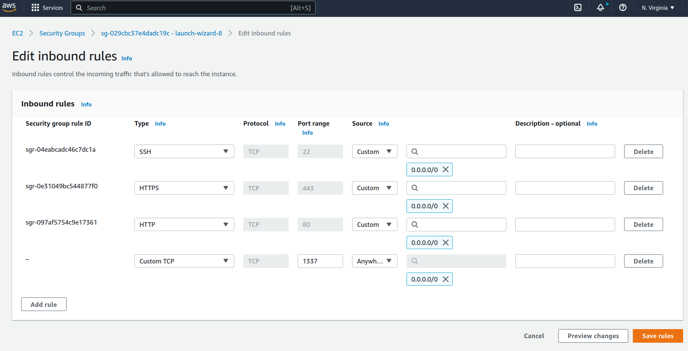
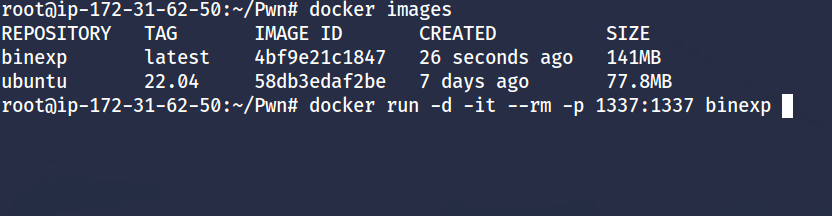
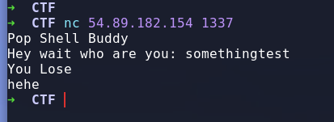
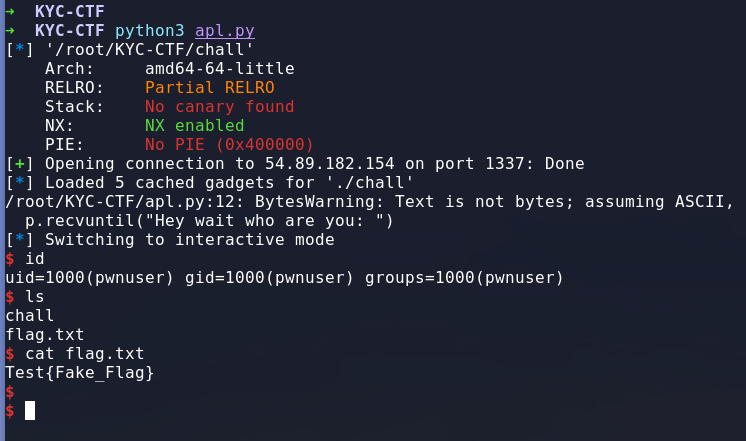

# Host-A-pwn-chall-in-Docker-via-EC2
### A small intro how to host pwn ctf challs in Docker via AWS EC2 Instance
#### File Structure


### AWS EC2 configure
### Step 1 

1. Create an Instance in aws , in security tab , click on inbound rules , there add custom TCP check box & add the custom port you want to host it on to



### Step 2
2. login to your instance , & install docker & start the docker service
```bash
$ sudo apt-get update
$ sudo apt-get install docker.io
$ sudo systemctl start docker
```

### Step 3
once everything is done , now build the Docker container & run it in background mode


```bash
$ docker build -t binexp .
$ docker images
$ docker run -d -it --rm -p 1337:1337 binexp 
```

### Step 4 
test & connect to the port using nc & see if everything is working or not


so the chall seems working on our intended Port

##### Lets try to exploit & see if something crashes or not 

we will run our exploit against the intended port & our instance IP , so lets see

#### Exploit

## Bingo !! It works fine 
## Happy Hacking <3
